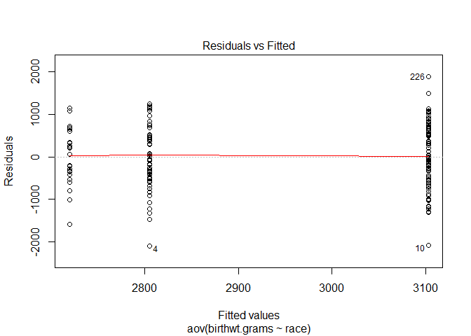

# Lab ฝึกการวิเคราะห์ข้อมูล

-   Import data file from csv file

``` r
library(MASS)
library(plyr)
library(ggplot2)

survey.messy <- read.csv("survey_messy.csv",header = TRUE)
str(survey.messy)
```

    ## 'data.frame':    31 obs. of  6 variables:
    ##  $ Program        : Factor w/ 3 levels "MISM","Other",..: 1 2 1 3 2 3 2 1 3 3 ...
    ##  $ PriorExp       : Factor w/ 3 levels "Extensive experience",..: 3 3 1 2 2 3 3 3 2 1 ...
    ##  $ Rexperience    : Factor w/ 3 levels "Basic competence",..: 3 1 1 2 3 3 3 3 3 3 ...
    ##  $ OperatingSystem: Factor w/ 2 levels "Mac OS X","Windows": 2 2 2 2 2 1 1 2 1 2 ...
    ##  $ TVhours        : Factor w/ 16 levels "~10","0","1",..: 3 15 10 12 9 1 2 4 6 10 ...
    ##  $ Editor         : Factor w/ 1 level "Microsoft Word": 1 1 1 1 1 1 1 1 1 1 ...

``` r
View(survey.messy)
```

-   Cleansing data

``` r
as.character(survey.messy$TVhours)[1:30]
```

    ##  [1] "1"                "8h"               "4"               
    ##  [4] "5"                "3"                "~10"             
    ##  [7] "0"                "10"               "15 (incl movies)"
    ## [10] "4"                "0"                "0"               
    ## [13] "10"               "4"                "10"              
    ## [16] "2hours"           "5"                "3"               
    ## [19] "0"                "1"                "2"               
    ## [22] "7"                "3"                "10"              
    ## [25] "6.5"              "40"               "0"               
    ## [28] "12"               "adfjalkj"         "3"

``` r
as.numeric(as.character(survey.messy$TVhours))[1:30]
```

    ## Warning: NAs introduced by coercion

    ##  [1]  1.0   NA  4.0  5.0  3.0   NA  0.0 10.0   NA  4.0  0.0  0.0 10.0  4.0
    ## [15] 10.0   NA  5.0  3.0  0.0  1.0  2.0  7.0  3.0 10.0  6.5 40.0  0.0 12.0
    ## [29]   NA  3.0

#### example

-   replace data

``` r
tv.hours.string <- as.character(survey.messy$TVhours)
tv.hours.string
```

    ##  [1] "1"                "8h"               "4"               
    ##  [4] "5"                "3"                "~10"             
    ##  [7] "0"                "10"               "15 (incl movies)"
    ## [10] "4"                "0"                "0"               
    ## [13] "10"               "4"                "10"              
    ## [16] "2hours"           "5"                "3"               
    ## [19] "0"                "1"                "2"               
    ## [22] "7"                "3"                "10"              
    ## [25] "6.5"              "40"               "0"               
    ## [28] "12"               "adfjalkj"         "3"               
    ## [31] "0"

``` r
gsub("[^0-9.]","",tv.hours.string)
```

    ##  [1] "1"   "8"   "4"   "5"   "3"   "10"  "0"   "10"  "15"  "4"   "0"  
    ## [12] "0"   "10"  "4"   "10"  "2"   "5"   "3"   "0"   "1"   "2"   "7"  
    ## [23] "3"   "10"  "6.5" "40"  "0"   "12"  ""    "3"   "0"

``` r
tv.hours.clean <- as.numeric(gsub("[^0-9.]","",tv.hours.string))
tv.hours.clean
```

    ##  [1]  1.0  8.0  4.0  5.0  3.0 10.0  0.0 10.0 15.0  4.0  0.0  0.0 10.0  4.0
    ## [15] 10.0  2.0  5.0  3.0  0.0  1.0  2.0  7.0  3.0 10.0  6.5 40.0  0.0 12.0
    ## [29]   NA  3.0  0.0

``` r
str(birthwt)
```

    ## 'data.frame':    189 obs. of  10 variables:
    ##  $ low  : int  0 0 0 0 0 0 0 0 0 0 ...
    ##  $ age  : int  19 33 20 21 18 21 22 17 29 26 ...
    ##  $ lwt  : int  182 155 105 108 107 124 118 103 123 113 ...
    ##  $ race : int  2 3 1 1 1 3 1 3 1 1 ...
    ##  $ smoke: int  0 0 1 1 1 0 0 0 1 1 ...
    ##  $ ptl  : int  0 0 0 0 0 0 0 0 0 0 ...
    ##  $ ht   : int  0 0 0 0 0 0 0 0 0 0 ...
    ##  $ ui   : int  1 0 0 1 1 0 0 0 0 0 ...
    ##  $ ftv  : int  0 3 1 2 0 0 1 1 1 0 ...
    ##  $ bwt  : int  2523 2551 2557 2594 2600 2622 2637 2637 2663 2665 ...

``` r
View(birthwt)
```

-   rename column name

``` r
colnames(birthwt) <- c(
  "birthwt.below.2500",
  "mother.age",
  "mother.weight",
  "race",
  "mother.smokes",
  "previous.prem.labor",
  "hypertension",
  "uterine.irr",
  "physician.visits",
  "birthwt.grams"
)
colnames(birthwt)
```

    ##  [1] "birthwt.below.2500"  "mother.age"          "mother.weight"      
    ##  [4] "race"                "mother.smokes"       "previous.prem.labor"
    ##  [7] "hypertension"        "uterine.irr"         "physician.visits"   
    ## [10] "birthwt.grams"

``` r
View(birthwt)
```

-   Transform variables to factors with descriptive levels

``` r
birthwt <- transform(birthwt, 
            race = as.factor(mapvalues(race, c(1, 2, 3), 
                              c("white","black", "other"))),
            mother.smokes = as.factor(mapvalues(mother.smokes, 
                              c(0,1), c("no", "yes"))),
            hypertension = as.factor(mapvalues(hypertension, 
                              c(0,1), c("no", "yes"))),
            uterine.irr = as.factor(mapvalues(uterine.irr, 
                              c(0,1), c("no", "yes")))
            )
```

-   summary data

``` r
summary(birthwt)
```

    ##  birthwt.below.2500   mother.age    mother.weight      race   
    ##  Min.   :0.0000     Min.   :14.00   Min.   : 80.0   black:26  
    ##  1st Qu.:0.0000     1st Qu.:19.00   1st Qu.:110.0   other:67  
    ##  Median :0.0000     Median :23.00   Median :121.0   white:96  
    ##  Mean   :0.3122     Mean   :23.24   Mean   :129.8             
    ##  3rd Qu.:1.0000     3rd Qu.:26.00   3rd Qu.:140.0             
    ##  Max.   :1.0000     Max.   :45.00   Max.   :250.0             
    ##  mother.smokes previous.prem.labor hypertension uterine.irr
    ##  no :115       Min.   :0.0000      no :177      no :161    
    ##  yes: 74       1st Qu.:0.0000      yes: 12      yes: 28    
    ##                Median :0.0000                              
    ##                Mean   :0.1958                              
    ##                3rd Qu.:0.0000                              
    ##                Max.   :3.0000                              
    ##  physician.visits birthwt.grams 
    ##  Min.   :0.0000   Min.   : 709  
    ##  1st Qu.:0.0000   1st Qu.:2414  
    ##  Median :0.0000   Median :2977  
    ##  Mean   :0.7937   Mean   :2945  
    ##  3rd Qu.:1.0000   3rd Qu.:3487  
    ##  Max.   :6.0000   Max.   :4990

-   plot graph

``` r
library(ggplot2)
par(mfrow = c(2,2))
with(birthwt,hist(mother.age))
plot(birthwt$mother.age)
plot(birthwt$mother.smokes)
```


-   using ggplot

``` r
diamonds.plot5 <- ggplot(data = diamonds,aes(x=carat, y=price, colour = color))
par(mfrow = c(2,2))
diamonds.plot5 + geom_point() + facet_wrap(~cut)
```


-   Analysis data
-   หาความสัมพันธ์ของข้อมูล

``` r
# View(birthwt)
birthwt.t.test <- t.test(birthwt.grams ~ mother.smokes, data=birthwt)
birthwt.t.test
```

    ## 
    ##  Welch Two Sample t-test
    ## 
    ## data:  birthwt.grams by mother.smokes
    ## t = 2.7299, df = 170.1, p-value = 0.007003
    ## alternative hypothesis: true difference in means is not equal to 0
    ## 95 percent confidence interval:
    ##   78.57486 488.97860
    ## sample estimates:
    ##  mean in group no mean in group yes 
    ##          3055.696          2771.919

``` r
birthwt.t.test$p.value
```

    ## [1] 0.007002548

``` r
birthwt.t.test$estimate
```

    ##  mean in group no mean in group yes 
    ##          3055.696          2771.919

``` r
birthwt.t.test$conf.int
```

    ## [1]  78.57486 488.97860
    ## attr(,"conf.level")
    ## [1] 0.95

``` r
aggregate(birthwt.grams ~ race, data = birthwt,FUN = mean)
```

    ##    race birthwt.grams
    ## 1 black      2719.692
    ## 2 other      2805.284
    ## 3 white      3102.719

``` r
summary(aov(birthwt.grams ~ race, data = birthwt))
```

    ##              Df   Sum Sq Mean Sq F value  Pr(>F)   
    ## race          2  5015725 2507863   4.913 0.00834 **
    ## Residuals   186 94953931  510505                   
    ## ---
    ## Signif. codes:  0 '***' 0.001 '**' 0.01 '*' 0.05 '.' 0.1 ' ' 1

``` r
phys.visit.binned <- birthwt$physician.visits
phys.visit.binned[phys.visit.binned>=3] <- "3.or.more"
birthwt <- transform(birthwt,phys.visit.binned=as.factor(phys.visit.binned))

birthwt$phys.visit.binned
```

    ##   [1] 0         3.or.more 1         2         0         0         1        
    ##   [8] 1         1         0         0         1         0         2        
    ##  [15] 0         0         0         3.or.more 0         1         2        
    ##  [22] 3.or.more 1         0         2         0         0         2        
    ##  [29] 0         1         1         1         1         1         0        
    ##  [36] 2         2         0         2         1         2         2        
    ##  [43] 1         0         0         0         3.or.more 0         2        
    ##  [50] 0         1         0         0         2         0         0        
    ##  [57] 0         0         0         0         0         2         0        
    ##  [64] 0         0         1         2         3.or.more 1         2        
    ##  [71] 0         2         1         0         0         0         1        
    ##  [78] 3.or.more 0         0         1         0         0         0        
    ##  [85] 0         0         0         0         0         1         0        
    ##  [92] 2         0         0         0         1         1         0        
    ##  [99] 0         1         1         0         0         1         0        
    ## [106] 0         1         0         2         3.or.more 2         1        
    ## [113] 2         1         0         1         0         0         2        
    ## [120] 1         1         0         1         0         2         2        
    ## [127] 1         0         1         1         0         2         0        
    ## [134] 0         0         0         1         1         0         1        
    ## [141] 0         0         0         1         0         2         2        
    ## [148] 0         0         0         1         2         0         0        
    ## [155] 0         0         3.or.more 1         0         0         0        
    ## [162] 1         0         0         0         0         3.or.more 0        
    ## [169] 1         0         1         0         0         0         0        
    ## [176] 0         1         3.or.more 0         2         1         3.or.more
    ## [183] 0         0         2         2         0         0         3.or.more
    ## Levels: 0 1 2 3.or.more

``` r
plot(birthwt$phys.visit.binned)
```

 \* function transfrom = การเปลี่ยนแปลง data

``` r
aov.birthwt <- aov(birthwt.grams ~ phys.visit.binned, data = birthwt)

aov.birthwt_race <- aov(birthwt.grams ~ race, data = birthwt)
summary(aov.birthwt_race)
```

    ##              Df   Sum Sq Mean Sq F value  Pr(>F)   
    ## race          2  5015725 2507863   4.913 0.00834 **
    ## Residuals   186 94953931  510505                   
    ## ---
    ## Signif. codes:  0 '***' 0.001 '**' 0.01 '*' 0.05 '.' 0.1 ' ' 1

``` r
plot(aov.birthwt_race)
```



### Run regression model

``` r
birthwt.lm <- lm(birthwt.grams ~ mother.age + mother.smokes, data = birthwt)
summary(birthwt.lm)
```

    ## 
    ## Call:
    ## lm(formula = birthwt.grams ~ mother.age + mother.smokes, data = birthwt)
    ## 
    ## Residuals:
    ##      Min       1Q   Median       3Q      Max 
    ## -2119.98  -442.66    52.92   532.38  1690.74 
    ## 
    ## Coefficients:
    ##                  Estimate Std. Error t value Pr(>|t|)    
    ## (Intercept)      2791.224    240.950  11.584   <2e-16 ***
    ## mother.age         11.290      9.881   1.143    0.255    
    ## mother.smokesyes -278.356    106.987  -2.602    0.010 *  
    ## ---
    ## Signif. codes:  0 '***' 0.001 '**' 0.01 '*' 0.05 '.' 0.1 ' ' 1
    ## 
    ## Residual standard error: 717.2 on 186 degrees of freedom
    ## Multiple R-squared:  0.04299,    Adjusted R-squared:  0.0327 
    ## F-statistic: 4.177 on 2 and 186 DF,  p-value: 0.0168

``` r
# plot(birthwt.lm)
qplot(data = birthwt,x=mother.age,y=birthwt.grams,colour=mother.smokes)+stat_smooth(method = "lm",fullrange = TRUE)
```


``` r
coef(birthwt.lm)["mother.age"]
```

    ## mother.age 
    ##   11.28961

``` r
age.coef <- round(coef(birthwt.lm)["mother.age"],1)
```

``` r
birthwt.lm2 <- lm(birthwt.grams ~ mother.age + mother.weight + mother.smokes + physician.visits, data = birthwt)
summary(birthwt.lm2)
```

    ## 
    ## Call:
    ## lm(formula = birthwt.grams ~ mother.age + mother.weight + mother.smokes + 
    ##     physician.visits, data = birthwt)
    ## 
    ## Residuals:
    ##      Min       1Q   Median       3Q      Max 
    ## -2083.97  -425.41    10.23   526.08  1820.19 
    ## 
    ## Coefficients:
    ##                  Estimate Std. Error t value Pr(>|t|)    
    ## (Intercept)      2370.211    302.827   7.827 3.81e-13 ***
    ## mother.age          6.628     10.143   0.653   0.5143    
    ## mother.weight       3.967      1.734   2.288   0.0233 *  
    ## mother.smokesyes -268.829    106.079  -2.534   0.0121 *  
    ## physician.visits   13.434     50.387   0.267   0.7901    
    ## ---
    ## Signif. codes:  0 '***' 0.001 '**' 0.01 '*' 0.05 '.' 0.1 ' ' 1
    ## 
    ## Residual standard error: 710.5 on 184 degrees of freedom
    ## Multiple R-squared:  0.07074,    Adjusted R-squared:  0.05054 
    ## F-statistic: 3.502 on 4 and 184 DF,  p-value: 0.00879

``` r
# qplot(data = birthwt,x=mother.age,y=birthwt.grams,colour=mother.smokes)+stat_smooth(method = "lm",fullrange = TRUE)
```
