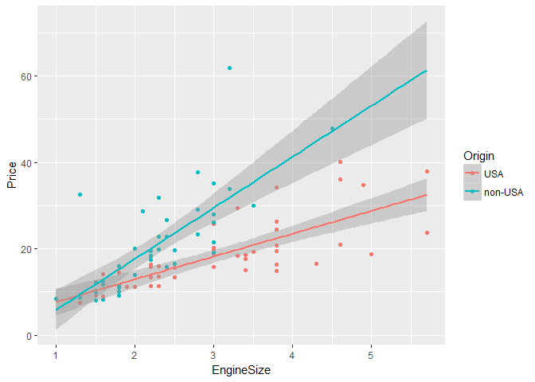
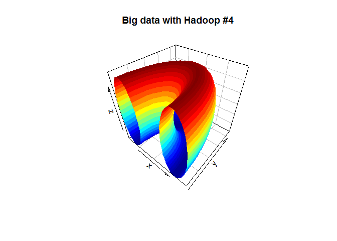

``` r
library(MASS)
library(plyr)
library(ggplot2)
```

``` r
View(Cars93)
```

``` r
mpg.t.test <- t.test(MPG.highway ~ Origin, data = Cars93)
mpg.t.test
```

    ## 
    ##  Welch Two Sample t-test
    ## 
    ## data:  MPG.highway by Origin
    ## t = -1.7545, df = 75.802, p-value = 0.08339
    ## alternative hypothesis: true difference in means is not equal to 0
    ## 95 percent confidence interval:
    ##  -4.1489029  0.2627918
    ## sample estimates:
    ##     mean in group USA mean in group non-USA 
    ##              28.14583              30.08889

at confident level = 90%
------------------------

``` r
mpg.t.test <- t.test(MPG.highway ~ Origin, data = Cars93, , conf.level = 0.90)
mpg.t.test
```

    ## 
    ##  Welch Two Sample t-test
    ## 
    ## data:  MPG.highway by Origin
    ## t = -1.7545, df = 75.802, p-value = 0.08339
    ## alternative hypothesis: true difference in means is not equal to 0
    ## 90 percent confidence interval:
    ##  -3.78725073 -0.09886038
    ## sample estimates:
    ##     mean in group USA mean in group non-USA 
    ##              28.14583              30.08889

``` r
with(Cars93, t.test(x = MPG.highway[Origin == "USA"], y = MPG.highway[Origin == "non-USA"]))
```

    ## 
    ##  Welch Two Sample t-test
    ## 
    ## data:  MPG.highway[Origin == "USA"] and MPG.highway[Origin == "non-USA"]
    ## t = -1.7545, df = 75.802, p-value = 0.08339
    ## alternative hypothesis: true difference in means is not equal to 0
    ## 95 percent confidence interval:
    ##  -4.1489029  0.2627918
    ## sample estimates:
    ## mean of x mean of y 
    ##  28.14583  30.08889

``` r
mpg.t.test$conf.int
```

    ## [1] -3.78725073 -0.09886038
    ## attr(,"conf.level")
    ## [1] 0.9

``` r
cars93.lm <- lm(MPG.highway ~ Origin + EngineSize + Price, data = Cars93 )
summary(cars93.lm)
```

    ## 
    ## Call:
    ## lm(formula = MPG.highway ~ Origin + EngineSize + Price, data = Cars93)
    ## 
    ## Residuals:
    ##     Min      1Q  Median      3Q     Max 
    ## -8.6724 -2.3519 -0.1561  1.9925 15.1270 
    ## 
    ## Coefficients:
    ##               Estimate Std. Error t value Pr(>|t|)    
    ## (Intercept)   37.99227    1.48516  25.581  < 2e-16 ***
    ## Originnon-USA  0.49817    1.02723   0.485 0.628891    
    ## EngineSize    -2.15998    0.61728  -3.499 0.000731 ***
    ## Price         -0.17350    0.06109  -2.840 0.005586 ** 
    ## ---
    ## Signif. codes:  0 '***' 0.001 '**' 0.01 '*' 0.05 '.' 0.1 ' ' 1
    ## 
    ## Residual standard error: 4.027 on 89 degrees of freedom
    ## Multiple R-squared:  0.4483, Adjusted R-squared:  0.4297 
    ## F-statistic:  24.1 on 3 and 89 DF,  p-value: 1.657e-11

``` r
# plot(cars93.lm)
qplot(data = Cars93,x=EngineSize,y=Price, colour=Origin)+stat_smooth(method = "lm",fullrange = TRUE)
```



``` r
library(plot3D)
R <- 6
r <- 3
x <- seq(0,2*pi,length.out = 50)
y <- seq(0,pi,length.out = 20)
M <- mesh(x,y)
alpha <- M$x
beta <- M$y
surf3D(x=(R + r*cos(alpha))*cos(beta),
       y=(R + r*cos(alpha))*sin(beta),
       z=r*sin(alpha),
       colkey = FALSE,
       bty = "b2",
       main = "Big data with Hadoop #4"
       )
```


