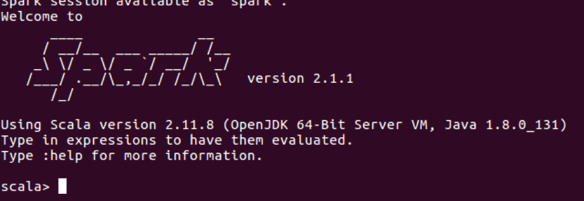

# ติดตั้ง Spark

#### ดาวโหลดไฟล์มาไว้ก่อนนะครับ

#### แตกไฟล์ที่ได้ ย้าย และให้สิทธิ
```
$ tar -xvf spark-2.1.1-bin-hadoop2.7.tgz
$ sudo mv spark-2.1.1-bin-hadoop2.7 /usr/local/spark
$ sudo chown user01:user01 -R /usr/local/spark
```

###  แก้ไขไฟล์ .bashrc
```
$ nano .bashrc
```
เพิ่มเข้าไปในไฟล์
```
export SPARK_HOME=/usr/local/spark
export PATH=$SPARK_HOME/bin:$PATH
```
refresh ค่า
```
$ source .bashrc
```

#### แก้ไขค่า config
```
$ cd /usr/local/spark/conf
$ cp spark-env.sh.template spark-env.sh
```
เพิ่มเข้าในไฟล์
```
HADOOP_CONF_DIR=/usr/local/hadoop/ect/Hadoop
export JAVA_HOME=/usr/lib/jvm/java-8-openjdk-amd64
```

#### สั่ง run Spark พร้อมใช้งาน
```
$ cd /usr/local/spark/sbin/
$ start-all.sh
$ spark-shell
```
จะได้


#### หรือทดสอบ
Open browser URL: http://localhost:4040
